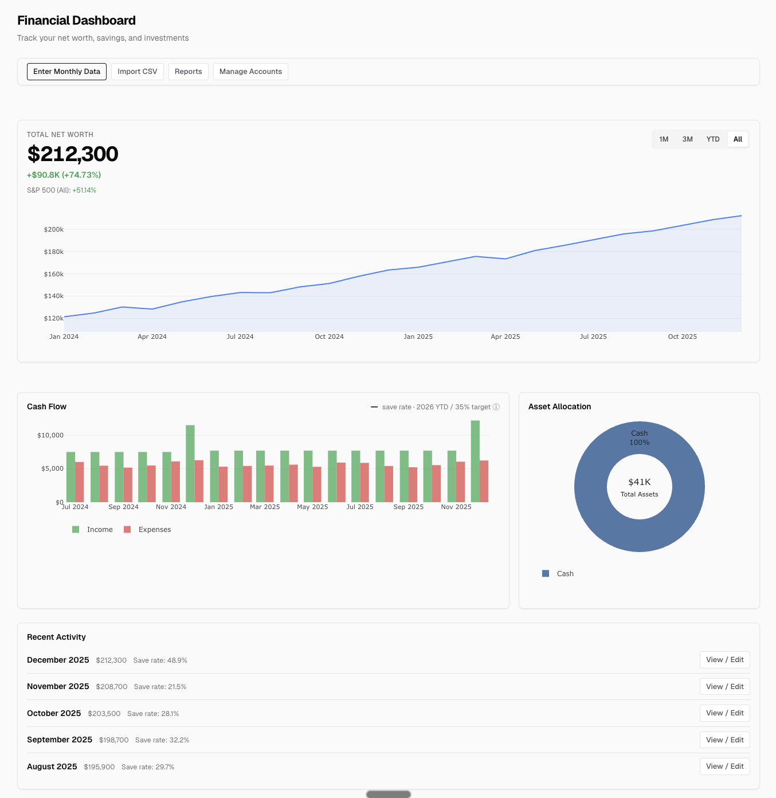
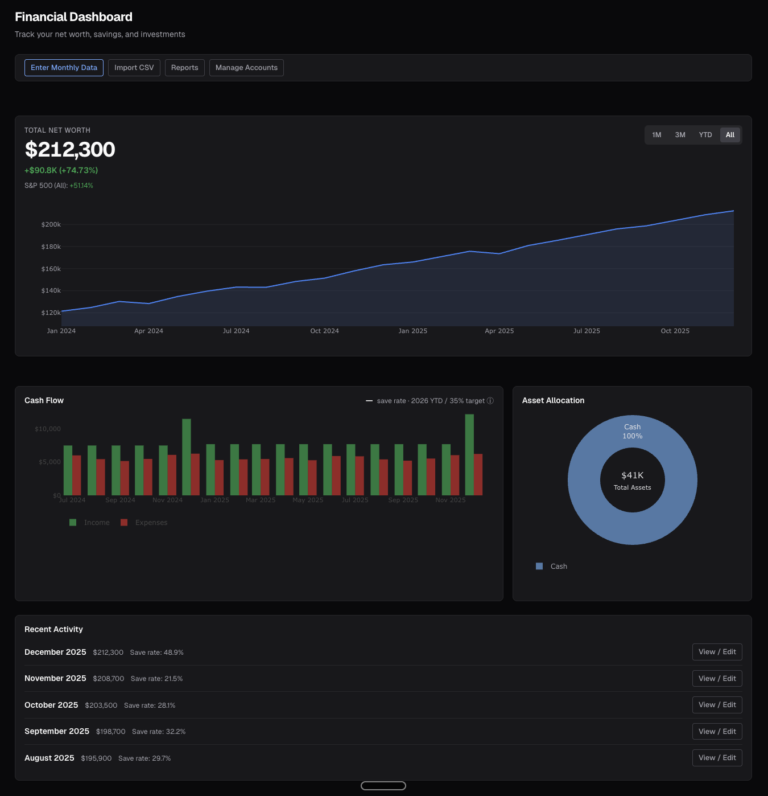
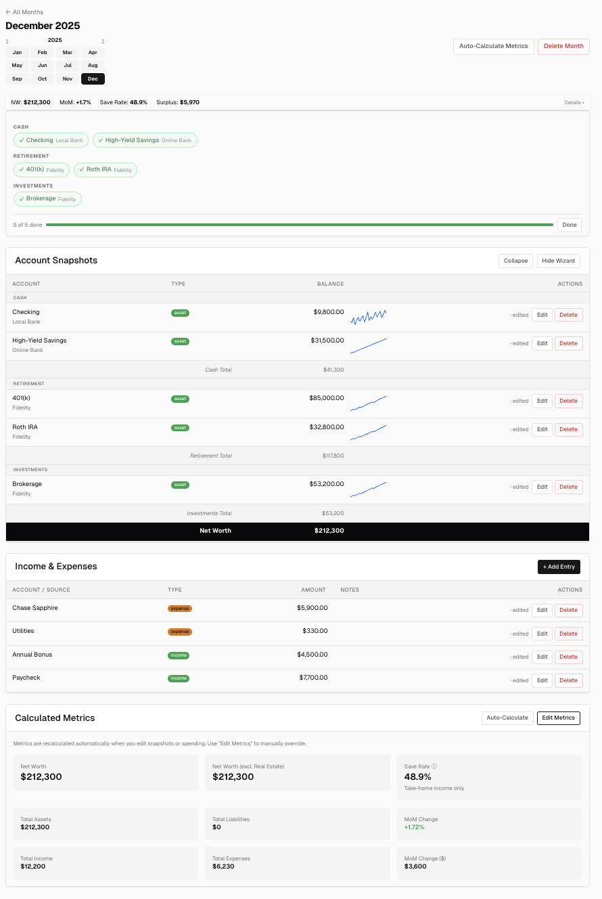
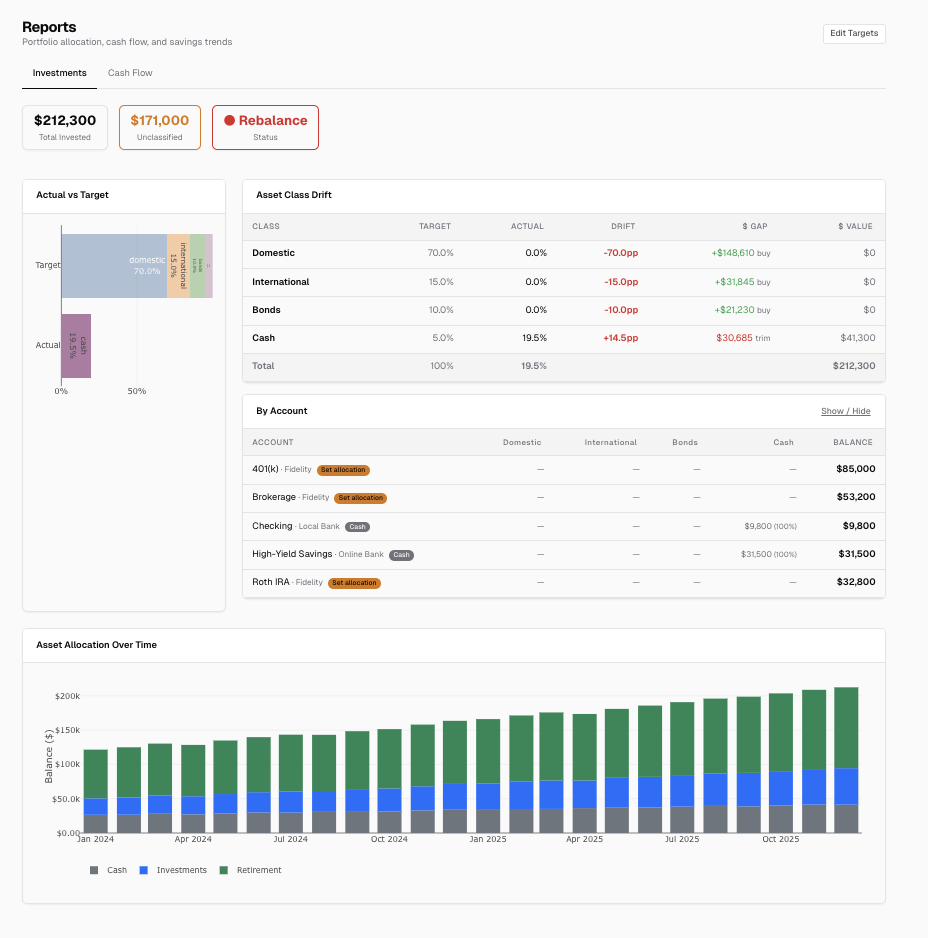
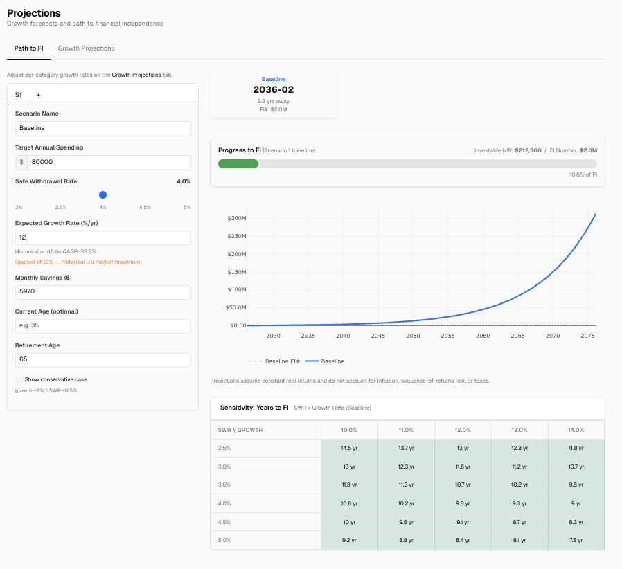

# Ledger Finance

[](https://github.com/your-username/ledger_finance/actions/workflows/ci.yml)
[](LICENSE)
[](https://www.python.org/)

A self-hosted personal finance dashboard for tracking net worth, savings rate, and asset distribution. Built for fast monthly data entry (<5 min/month) with flexible visualizations.

> **Security Notice**
>
> Ledger Finance has **no built-in authentication**. It is designed for use on a trusted local network or behind a VPN. **Do not expose this application to the public internet** without first adding authentication (e.g. HTTP Basic Auth in Nginx, [Authelia](https://www.authelia.com/), or a self-hosted VPN like WireGuard/Tailscale). Exposing your personal financial data without a password is a significant security risk.

---

## Features

- **Net worth tracking** across assets and liabilities with automatic monthly metrics calculation
- **Monthly data entry** with per-account balance snapshots and inline editing
- **CSV import** for historical data with flexible month header parsing (`Jan '24`, `Jan 2024`, `2024-01`, etc.)
- **Spending tracking** by account/card (income and expenses)
- **Interactive charts** via Plotly (net worth history, account balance history)
- **Import audit log** tracking all CSV import history

---

## Screenshots











To see the app populated with realistic demo data (~$120k–$212k net worth trajectory over 24 months), run the seed script after setup:

```bash
python scripts/seed_demo.py
```

---

## Tech Stack

- **Backend:** Python 3, Flask 3.0, SQLAlchemy 2.0, Flask-Migrate
- **Database:** SQLite (local, zero-config)
- **Frontend:** Bootstrap 5, Plotly 5.18, vanilla JS
- **Data processing:** pandas 2.2

---

## Quick Start (Local Development)

### Prerequisites

- Python 3.10+
- Git

### Installation

```bash
git clone https://github.com/your-username/ledger_finance.git
cd ledger_finance
python3 -m venv venv
source venv/bin/activate        # Windows: venv\Scripts\activate
pip install -r requirements.txt
```

### Configure environment

Generate a secret key:

```bash
python3 -c "import secrets; print(secrets.token_hex(32))"
```

Create a `.env` file in the project root:

```
SECRET_KEY=<paste-generated-key-here>
DATABASE_URL=sqlite:///data/finance.db
FLASK_ENV=development
```

### Run the app

```bash
python run.py
```

App runs at **http://localhost:5001** and creates `data/finance.db` on first launch.

---

## CSV Import Format

Go to `/import` and upload a CSV in this format:

```
Category,Jan '24,Feb '24,...
Cash,"$25,000","$26,500",...
Retirement,"$150,000","$152,000",...
Investments,"$75,000","$76,000",...
Real Estate,"$400,000","$400,000",...
Mortgage,"$300,000","$299,000",...
Income,"$8,000","$8,000",...
Expenses,"$5,500","$5,200",...
```

Accepted month header formats: `Jan '24`, `Jan 2024`, `January 2024`, `2024-01`, `01/2024`

CSV import is idempotent — re-importing the same data upserts without duplicating.

---

## Project Structure

```
ledger_finance/
├── app/
│   ├── __init__.py           # Flask app factory
│   ├── models.py             # SQLAlchemy models
│   ├── routes.py             # Page routes + REST API
│   ├── import_processor.py   # CSV parsing and import logic
│   ├── templates/            # Jinja2 HTML templates
│   └── static/               # CSS and JS assets
├── data/                     # SQLite DB lives here (gitignored)
├── logs/                     # App logs (gitignored)
├── migrations/               # Flask-Migrate migrations
├── scripts/                  # Utility scripts
├── tests/                    # Test suite
├── .env                      # Environment variables (gitignored)
├── requirements.txt
└── run.py                    # Entry point (port 5001)
```

---

## Database Schema

| Table | Purpose |
|---|---|
| `accounts` | Financial accounts (Cash, Retirement, Investments, Real Estate, Mortgage) |
| `account_snapshots` | Monthly balance per account — one row per account per month |
| `spending_entries` | Income and expenses tracked by card/account name |
| `asset_allocations` | Asset class distribution per investment account |
| `calculated_metrics` | Pre-computed monthly totals (net worth, save rate, monthly change) |
| `app_settings` | Key/value config store (e.g. target allocation percentages) |
| `import_logs` | Audit trail for CSV imports |

Metrics are automatically recalculated whenever a snapshot or spending entry is written. All currency values use `Numeric(12,2)` to avoid floating point errors. Dates are stored as the first day of the month.

---

## Deployment

### Security Before You Deploy

Ledger Finance is a **local-network application**. Before exposing it on any network:

- It has no login screen, session management, or user accounts
- Anyone who can reach the app's IP and port can read and modify all your financial data
- **Acceptable deployments:** home LAN accessible only from trusted devices, or behind a VPN (WireGuard, Tailscale, etc.)
- **Unacceptable:** forwarding port 80 or 5001 to the public internet without authentication
- If you want browser access from outside your home network, use a VPN rather than port-forwarding

Optional hardening: add [HTTP Basic Auth to Nginx](https://docs.nginx.com/nginx/admin-guide/security-controls/configuring-http-basic-authentication/) as a lightweight password layer for LAN use.

---

### Docker (Quickest Setup)

The fastest way to run Ledger Finance on any machine with Docker installed.

**1. Generate a secret key:**

```bash
python3 -c "import secrets; print(secrets.token_hex(32))"
```

**2. Create a `.env` file** (or copy `.env.example`):

```
SECRET_KEY=<paste-generated-key-here>
DATABASE_URL=sqlite:////app/data/finance.db
FLASK_ENV=production
```

**3. Start the container:**

```bash
docker compose up -d
```

Open **http://localhost:5001** in your browser. Data is persisted in `./data/finance.db` on your host machine. To stop: `docker compose down`.

To update after a code change: `docker compose build && docker compose up -d`.

---

### Raspberry Pi (Recommended for Self-Hosting)

Deploy Ledger Finance as a persistent web server on a Raspberry Pi using Gunicorn (app server) and Nginx (reverse proxy). This replaces Flask's built-in dev server with a production-grade setup.

#### Architecture

```
Browser → Nginx (port 80) → Unix Socket → Gunicorn → Flask app
```

- **Nginx** handles incoming HTTP requests, serves static files, and proxies dynamic requests to Gunicorn via a Unix socket.
- **Gunicorn** is a production WSGI server that runs your Flask app with multiple worker processes.
- **systemd** keeps Gunicorn running as a background service that restarts on failure or reboot.
- **Unix socket** is used instead of a TCP port for faster, more secure local communication between Nginx and Gunicorn.

#### Prerequisites

- Raspberry Pi running Raspberry Pi OS (Debian-based, 64-bit recommended)
- Python 3.10+
- Git installed
- SSH access to the Pi (or keyboard/monitor attached)

#### Step 1: System Setup

Install system dependencies including OpenBLAS, which is required by numpy/pandas on ARM:

```bash
sudo apt update && sudo apt upgrade -y
sudo apt install -y python3-pip python3-venv git nginx libopenblas-dev
```

> **Why `libopenblas-dev`?** Numpy (used by pandas) requires OpenBLAS as a system library on Raspberry Pi. Without it, the app will fail to start with `libopenblas.so.0: cannot open shared object file`.

#### Step 2: Clone the Repository

```bash
cd /home/your-username
git clone https://github.com/your-username/ledger_finance.git
cd ledger_finance
```

#### Step 3: Python Virtual Environment & Dependencies

Create the venv and install dependencies. Because `/tmp` is RAM-backed and limited on the Pi, redirect pip's temp directory to disk to avoid `No space left on device` errors:

```bash
python3 -m venv venv && source venv/bin/activate
pip install --upgrade pip
mkdir -p /home/your-username/tmp
TMPDIR=/home/your-username/tmp pip install -r requirements.txt
TMPDIR=/home/your-username/tmp pip install gunicorn
```

> **Note:** `/tmp` on Raspberry Pi OS is a `tmpfs` (RAM-backed), capped at ~214MB. Large pip installs will fail if it fills up. Using `TMPDIR` redirects scratch space to the SD card instead.

#### Step 4: Environment Configuration

Generate a strong secret key first:

```bash
python3 -c "import secrets; print(secrets.token_hex(32))"
```

Copy the output, then create the `.env` file:

```bash
nano /home/your-username/ledger_finance/.env
```

Add the following, pasting your generated key:

```
SECRET_KEY=<paste-generated-key-here>
DATABASE_URL=sqlite:////home/your-username/ledger_finance/data/finance.db
FLASK_ENV=production
```

Ensure the data and logs directories exist:

```bash
mkdir -p /home/your-username/ledger_finance/data
mkdir -p /home/your-username/ledger_finance/logs
```

#### Step 5: Fix Home Directory Permissions

Nginx runs as `www-data` and needs execute permission on your home directory to traverse into it and reach the Unix socket:

```bash
sudo chmod o+x /home/your-username
```

> **Skip this and you'll get a 502 Bad Gateway** even when Gunicorn is running and the socket exists.

#### Step 6: Initialize the Database

```bash
cd /home/your-username/ledger_finance
source venv/bin/activate
flask db upgrade
```

#### Step 7: Test Gunicorn Manually

Before setting up the service, verify Gunicorn can serve the app:

```bash
cd /home/your-username/ledger_finance
source venv/bin/activate
/home/your-username/ledger_finance/venv/bin/gunicorn --bind 0.0.0.0:5001 --workers 2 "run:app"
```

Visit `http://<pi-ip-address>:5001` in your browser. If the app loads, kill it with `Ctrl+C` and continue.

> **Always use the full venv path** (`/home/your-username/ledger_finance/venv/bin/gunicorn`) rather than just `gunicorn`, to ensure it uses the venv's Python where all dependencies are installed.

> **Worker count:** 2 workers is a safe default for a Pi. The general formula is `(2 × CPU cores) + 1`, but Pi resources are limited.

#### Step 8: Create a systemd Service

This makes Gunicorn start automatically on boot and restart on failure.

```bash
sudo nano /etc/systemd/system/ledger_finance.service
```

Paste the following, replacing `your-username` with your actual username:

```ini
[Unit]
Description=Ledger Finance - Personal Finance Dashboard
After=network.target

[Service]
User=your-username
Group=www-data
WorkingDirectory=/home/your-username/ledger_finance
Environment="PATH=/home/your-username/ledger_finance/venv/bin"
EnvironmentFile=/home/your-username/ledger_finance/.env
ExecStart=/home/your-username/ledger_finance/venv/bin/gunicorn \
    --workers 2 \
    --bind unix:/home/your-username/ledger_finance/ledger_finance.sock \
    --umask 007 \
    --access-logfile /home/your-username/ledger_finance/logs/access.log \
    --error-logfile /home/your-username/ledger_finance/logs/error.log \
    run:app
Restart=always

[Install]
WantedBy=multi-user.target
```

> **Why `--umask 007`?** Gunicorn creates the Unix socket file with the system's default umask (`022`), which gives the socket `644` permissions (`rw-r--r--`). The `www-data` group (Nginx's user) would only have *read* access, but connecting to a Unix socket requires *write* permission — causing a 502 even when Gunicorn is running. `--umask 007` creates the socket with `660` (`rw-rw----`), giving the `www-data` group the write access it needs.

Enable and start the service:

```bash
sudo systemctl daemon-reload
sudo systemctl enable ledger_finance
sudo systemctl start ledger_finance
sudo systemctl status ledger_finance
```

You should see `active (running)` in the output.

#### Step 9: Configure Nginx

> **Security reminder:** This Nginx config listens on port 80 with no authentication. It is safe on a private LAN or VPN. Do not forward this port to the public internet.

Create a new Nginx site config:

```bash
sudo nano /etc/nginx/sites-available/ledger_finance
```

Paste the following, replacing `your-username` with your actual username:

```nginx
server {
    listen 80;
    server_name _;

    location /static/ {
        alias /home/your-username/ledger_finance/app/static/;
        expires 30d;
        add_header Cache-Control "public, immutable";
    }

    location / {
        include proxy_params;
        proxy_pass http://unix:/home/your-username/ledger_finance/ledger_finance.sock;
        proxy_read_timeout 120s;
        proxy_connect_timeout 10s;
    }
}
```

Enable the site and remove the default:

```bash
sudo ln -s /etc/nginx/sites-available/ledger_finance /etc/nginx/sites-enabled/
sudo rm /etc/nginx/sites-enabled/default
sudo nginx -t          # Test config — should print "ok"
sudo systemctl restart nginx
sudo systemctl enable nginx
```

#### Step 10: Verify the Deployment

1. Find your Pi's local IP address: `hostname -I`
2. On any device on the same network, open `http://<pi-ip-address>` in a browser.
3. Ledger Finance should load via port 80 (no port number needed in the URL).

#### Step 11: (Optional) Assign a Static IP to the Pi

To always reach the Pi at the same address, configure a DHCP reservation in your router's admin panel using the Pi's MAC address. This is easier than configuring a static IP on the Pi itself.

#### Step 12: (Optional) Local Hostname with mDNS

Install `avahi-daemon` so you can reach the Pi by name instead of IP:

```bash
sudo apt install -y avahi-daemon
```

To set a custom hostname (e.g. access via `http://ledger-finance.local`):

```bash
sudo hostnamectl set-hostname ledger-finance
sudo systemctl restart avahi-daemon
```

> **Pi-hole compatibility:** Pi-hole and Ledger Finance can run on the same Pi without conflict. Pi-hole uses port 80 for its own admin UI by default — if you install both, configure Pi-hole to use a different port (e.g. 8080) before setting up Nginx for Ledger Finance.

#### Quick Restart Reference

If the Pi reboots, both Nginx and the Ledger Finance service are set to start automatically via systemd (`enable` was run during setup). You shouldn't need to do anything.

If something isn't working after a reboot, run these in order:

```bash
# 1. Check if Gunicorn is running
sudo systemctl status ledger_finance

# 2. Check if Nginx is running
sudo systemctl status nginx

# 3. If either is stopped, restart it
sudo systemctl start ledger_finance
sudo systemctl start nginx

# 4. If you made code or config changes, do a full restart
sudo systemctl restart ledger_finance
sudo systemctl reload nginx
```

To manually restart everything at once:

```bash
sudo systemctl restart ledger_finance && sudo systemctl reload nginx
```

#### Updating the App

```bash
cd /home/your-username/ledger_finance
git pull origin main
source venv/bin/activate
TMPDIR=/home/your-username/tmp pip install -r requirements.txt   # If dependencies changed
flask db upgrade                                                   # If models changed
sudo systemctl restart ledger_finance
```

#### Useful Management Commands

```bash
# View Gunicorn service status
sudo systemctl status ledger_finance

# View application logs
tail -f /home/your-username/ledger_finance/logs/error.log
tail -f /home/your-username/ledger_finance/logs/access.log

# View Nginx logs
sudo tail -f /var/log/nginx/error.log

# Check socket exists and permissions
ls -la /home/your-username/ledger_finance/ledger_finance.sock
```

#### Troubleshooting

| Symptom | Check |
|---|---|
| 502 Bad Gateway | Run `sudo systemctl status ledger_finance` — is Gunicorn running? Two common causes: (1) home directory permissions — run `sudo chmod o+x /home/your-username`; (2) socket permissions — ensure `--umask 007` is present in the `ExecStart` line of `ledger_finance.service` (without it the socket is created `644` and Nginx can't write to it) |
| `No module named 'flask'` on startup | Dependencies not installed in venv. Run `TMPDIR=/home/your-username/tmp /home/your-username/ledger_finance/venv/bin/pip install -r requirements.txt` |
| `libopenblas.so.0` error | Run `sudo apt install -y libopenblas-dev` then `sudo systemctl restart ledger_finance` |
| `No space left on device` during pip install | `/tmp` is full (RAM-backed). Use `TMPDIR=/home/your-username/tmp pip install ...` instead |
| App loads but no styles | Verify the `/static/` alias path in Nginx matches your actual static folder |
| Can't reach Pi from network | Confirm Pi's IP with `hostname -I`; check your router firewall isn't blocking port 80 |
| Database errors after update | Run `flask db upgrade` then `sudo systemctl restart ledger_finance` |

---

## Database Migrations

When models change:

```bash
flask db migrate -m "description"
flask db upgrade
```

---

## API Reference

| Method | Endpoint | Description |
|---|---|---|
| GET | `/api/networth-history` | Net worth time series |
| GET | `/api/account-balances/<id>` | Balance history for one account |
| GET | `/api/months` | List of all months with summary metrics |
| POST | `/api/months` | Create a new month |
| DELETE | `/api/months/<YYYY-MM>` | Delete all data for a month |
| POST | `/api/snapshots` | Create or update an account snapshot |
| PUT | `/api/snapshots/<id>` | Update snapshot balance |
| DELETE | `/api/snapshots/<id>` | Delete a snapshot |

---

## Development Notes

- Port is **5001** (not 5000) — changed to avoid conflict with macOS AirPlay
- Uses Flask application factory pattern (`create_app()`)
- CSV import is idempotent — re-importing the same data upserts without duplicating
- `.csv` files and `data/finance.db` are gitignored

---

## License

MIT
